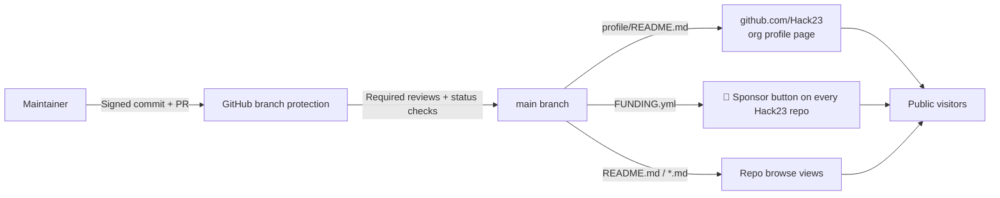
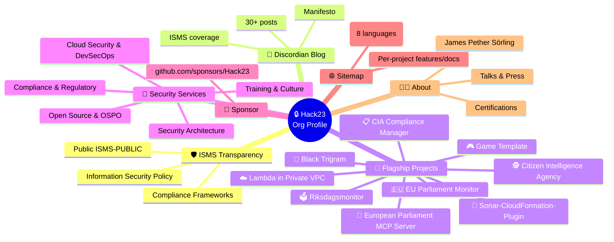
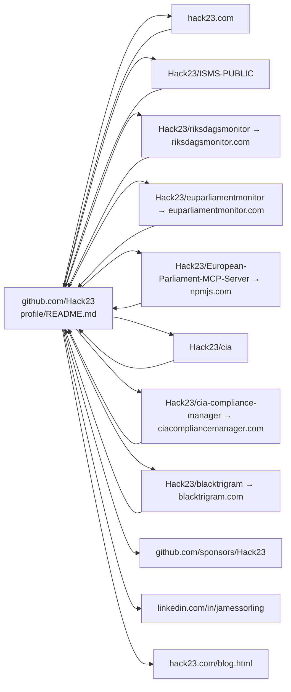

<!-- SPDX-FileCopyrightText: 2024-2026 Hack23 AB -->
<!-- SPDX-License-Identifier: Apache-2.0 -->

# 🏛️ Architecture — `Hack23/.github` Organisation Meta Repository

> **Documentation-only repository.** No build, no runtime, no application code, no user data. Architecture is therefore an **information-architecture** description of how GitHub renders the org profile and how default community-health files propagate across all Hack23 repositories.

| Property | Value |
|:---------|:------|
| Owner | CEO (James Pether Sörling) |
| Classification | 🟢 Public |
| Stack | Markdown · GitHub Flavored Markdown · Mermaid · GitHub-rendered HTML |
| Hosting | github.com (managed by GitHub, Inc.) |
| Build | None — GitHub renders Markdown server-side |
| Review cycle | Annual (or on material change) |
| ISMS reference | [Secure Development Policy](https://github.com/Hack23/ISMS-PUBLIC/blob/main/Secure_Development_Policy.md) |

---

## 1. Repository structure

```
Hack23/.github/
├── README.md                  # This repo's own meta README (navigation hub)
├── FUNDING.yml                # Default GitHub Sponsors config — inherited by all Hack23 repos
├── ARCHITECTURE.md            # ← you are here
├── SECURITY_ARCHITECTURE.md   # Defense-in-depth controls (ISMS-aligned)
├── THREAT_MODEL.md            # STRIDE + MITRE ATT&CK threat model
└── profile/
    └── README.md              # Org profile rendered at github.com/Hack23
```

There is **no source code, no CI workflow, no package**. All "behaviour" is provided by GitHub's first-party rendering of these Markdown files.

---

## 2. How the org profile renders



- **`profile/README.md`** is the special path GitHub looks for in any organisation's `.github` repo to render the public org landing page (<https://github.com/Hack23>).
- **`FUNDING.yml`** at the root of the org-level `.github` repo is inherited by every repository in the org that does **not** ship its own `.github/FUNDING.yml`. The 💖 Sponsor button on every Hack23 repo flows from this single file.
- All other `.md` files in this repo are addressable directly via raw GitHub URLs and serve as canonical references for ISMS audits and external citations.

---

## 3. Information architecture (profile README sections)



---

## 4. Cross-organisation link map

The profile is the **canonical entry point** for SEO and discoverability across every Hack23 surface. Every flagship project README and every `hack23.com` page links back to this profile, and the profile links forward to every product surface.



---

## 5. Change-management architecture

| Stage | Control |
|:------|:--------|
| Authoring | Local Markdown edit, optional Mermaid preview |
| Submission | Pull request (no direct push to `main`) |
| Authentication | GitHub MFA (TOTP / WebAuthn) — per [Access Control Policy](https://github.com/Hack23/ISMS-PUBLIC/blob/main/Access_Control_Policy.md) |
| Integrity | GPG/SSH-signed commits — verified by GitHub |
| Review | At least one approving review by an org owner |
| Audit trail | Immutable Git history, GitHub audit log, signed-commit verification |
| Publication | Merge → `main` → GitHub renders within seconds |
| Continuity | Distributed Git replication (every clone is a backup) |

---

## 6. References

- [Hack23 ISMS — Secure Development Policy](https://github.com/Hack23/ISMS-PUBLIC/blob/main/Secure_Development_Policy.md)
- [Hack23 ISMS — Change Management](https://github.com/Hack23/ISMS-PUBLIC/blob/main/Change_Management.md)
- [Hack23 ISMS — Access Control Policy](https://github.com/Hack23/ISMS-PUBLIC/blob/main/Access_Control_Policy.md)
- [GitHub Docs — Customizing your organization's profile](https://docs.github.com/en/organizations/collaborating-with-groups-in-organizations/customizing-your-organizations-profile)
- [GitHub Docs — Displaying a sponsor button in your repository](https://docs.github.com/en/repositories/managing-your-repositorys-settings-and-features/customizing-your-repository/displaying-a-sponsor-button-in-your-repository)
