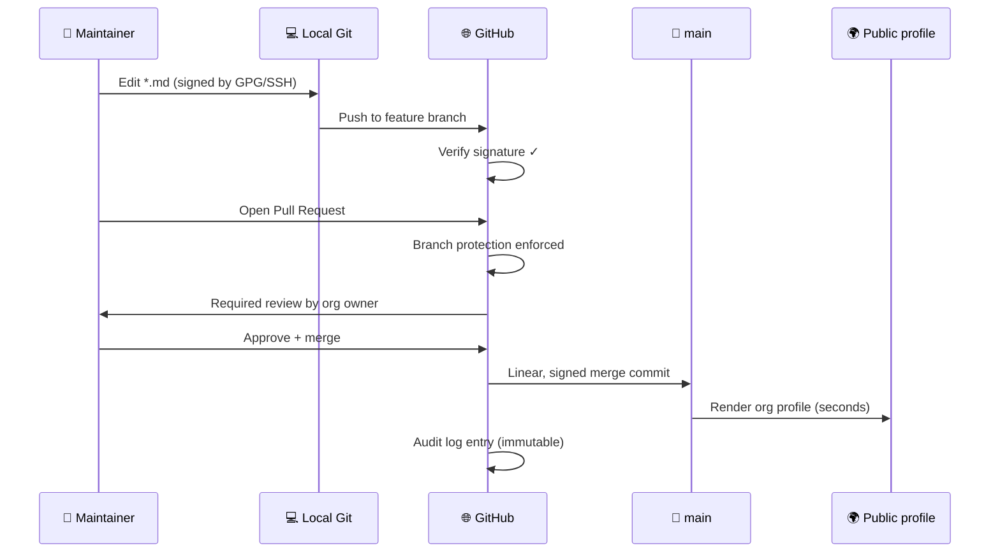

<!-- SPDX-FileCopyrightText: 2024-2026 Hack23 AB -->
<!-- SPDX-License-Identifier: Apache-2.0 -->

# 🛡️ Security Architecture — `Hack23/.github`

> **Defense-in-depth for a documentation-only repository.** This document follows the pattern established by the [ISMS SECURITY_ARCHITECTURE.md](https://github.com/Hack23/ISMS/blob/main/SECURITY_ARCHITECTURE.md) reference implementation and the [Hack23 Secure Development Policy](https://github.com/Hack23/ISMS-PUBLIC/blob/main/Secure_Development_Policy.md). Because the repository ships no executable code, the security objective is **integrity, authenticity and availability of public-facing documentation**, not application security.

| Property | Value |
|:---------|:------|
| Owner | CEO (James Pether Sörling) |
| Classification | 🟢 Public |
| Confidentiality | None — all content is intentionally public |
| Integrity | 🔴 Critical — tampering is the primary threat |
| Availability | 🟡 Important — supplied by GitHub SLA (99.9%) |
| Compliance | ISO 27001:2022 · NIST CSF 2.0 · CIS Controls v8.1 · EU CRA |
| Last review | 2026-04-28 |

---

## 1. Security objectives (CIA mapping)

| Objective | Target | Rationale |
|:----------|:-------|:----------|
| **Confidentiality** | Not applicable | All content public-by-design (Classification 🟢 Public). |
| **Integrity** | 🔴 Critical | Tampering with the org profile, FUNDING.yml or ISMS-aligned docs would mislead visitors, redirect sponsorship money, or fabricate compliance claims. |
| **Availability** | 99.9% (GitHub SLA) | Outage degrades trust signals (badges, ISMS visibility) but does not affect any production system. |
| **Authenticity** | All commits signed | Required by [Secure Development Policy](https://github.com/Hack23/ISMS-PUBLIC/blob/main/Secure_Development_Policy.md). |

---

## 2. Defense-in-depth layers

```mermaid
graph TB
    subgraph L1["🌐 Layer 1 — GitHub Platform Security"]
        A1[GitHub Enterprise infrastructure]
        A2[TLS 1.3 in transit]
        A3[DDoS protection · global CDN]
        A4[Platform SOC 2 Type II / ISO 27001]
    end
    subgraph L2["🔑 Layer 2 — Identity & Access"]
        B1[Mandatory MFA — TOTP / WebAuthn]
        B2[Org-owner role, least privilege]
        B3[SSH keys + GPG signing keys]
        B4[Personal Access Tokens — fine-grained, short-lived]
    end
    subgraph L3["🌿 Layer 3 — Branch & Repo Controls"]
        C1[Branch protection on main]
        C2[Required PR reviews]
        C3[Required signed commits]
        C4[Linear history · no force-push]
        C5[CODEOWNERS for sensitive paths]
    end
    subgraph L4["🔍 Layer 4 — Continuous Verification"]
        D1[Dependabot — even Markdown deps]
        D2[Secret scanning + push protection]
        D3[GitHub audit log — org-wide]
        D4[OpenSSF Scorecard — public]
    end
    subgraph L5["💾 Layer 5 — Integrity & Continuity"]
        E1[Git immutable audit trail]
        E2[Distributed clones — every dev is a backup]
        E3[Tag/release signing]
    end
    subgraph L6["📋 Layer 6 — Governance"]
        F1[Public ISMS — ISMS-PUBLIC]
        F2[Annual review of this document]
        F3[Incident Response Plan]
    end
    L1 --> L2 --> L3 --> L4 --> L5 --> L6
```

---

## 3. Authentication & access control

| Control | Implementation | Reference |
|:--------|:---------------|:----------|
| Multi-factor authentication | **Required** for all org members; WebAuthn preferred over TOTP | [Access Control Policy](https://github.com/Hack23/ISMS-PUBLIC/blob/main/Access_Control_Policy.md) |
| SSH key authentication | Ed25519 or RSA-4096 only | [Cryptography Policy](https://github.com/Hack23/ISMS-PUBLIC/blob/main/Cryptography_Policy.md) |
| Commit signing | GPG (RSA-4096 or Ed25519) or SSH signing — **required** for `main` | Secure Development Policy §Authenticity |
| Org-owner role | Single-person (CEO) until further org members are added; least-privilege team membership | Access Control Policy |
| Personal Access Tokens | Fine-grained PATs only, ≤90-day expiry, scoped to specific repos | Access Control Policy §PAT |
| Session management | GitHub session timeout + device authorisation | Platform-managed |

---

## 4. Change management & integrity

- No direct pushes to `main`.
- All commits cryptographically signed and verified by GitHub.
- Audit log retained per GitHub Enterprise retention policy.

---

## 5. Cryptography

| Use | Algorithm | Source |
|:----|:----------|:-------|
| Transport | TLS 1.3 (GitHub-managed) | GitHub platform |
| Commit signing | GPG (RSA-4096 / Ed25519) or SSH (Ed25519) | [Cryptography Policy](https://github.com/Hack23/ISMS-PUBLIC/blob/main/Cryptography_Policy.md) |
| Tag / release signing | GPG | Cryptography Policy |
| At-rest encryption | GitHub-managed (LUKS / KMS at the platform layer) | GitHub platform |

No deprecated algorithms (MD5, SHA-1, DES, RC4) are used or accepted.

---

## 6. Monitoring, logging & detection

| Control | Tool | Trigger |
|:--------|:-----|:--------|
| Audit logging | GitHub org audit log | Every administrative event |
| Authentication anomalies | GitHub security alerts | Suspicious login / device |
| Secret scanning | GitHub Advanced Security | Pre- and post-commit |
| Push protection | GitHub Advanced Security | Block secret pushes |
| Dependency scanning | Dependabot | Daily |
| Supply-chain posture | OpenSSF Scorecard (where applicable) | Weekly |
| Public-facing changes | RSS / GitHub Watch on the org | Real-time |

---

## 7. Incident response

If unauthorised modification, account compromise, or sponsorship-link tampering is detected:

1. **Contain** — revert affected commit; rotate any compromised tokens / SSH keys / GPG keys.
2. **Investigate** — pull the GitHub audit log, identify actor, scope, and timeline.
3. **Eradicate** — remove malicious content from `main` and from any cached views (GitHub renders quickly; cache TTL is short).
4. **Recover** — re-deploy known-good documentation from signed commits.
5. **Report** — follow the [Incident Response Plan](https://github.com/Hack23/ISMS-PUBLIC/blob/main/Incident_Response_Plan.md); publish a transparent post-mortem on `hack23.com/blog.html`.
6. **Improve** — update this document and the [Risk Register](https://github.com/Hack23/ISMS-PUBLIC/blob/main/Risk_Register.md).

---

## 8. Compliance mapping

| Framework | Control(s) addressed |
|:----------|:---------------------|
| **ISO 27001:2022** | A.5.1 Policies · A.5.15 Access control · A.8.2 Privileged access · A.8.5 Secure authentication · A.8.9 Configuration management · A.8.28 Secure coding |
| **NIST CSF 2.0** | GV.PO Policy · ID.AM Asset management · PR.AA Identity management · PR.DS Data security · DE.CM Continuous monitoring · RS.MA Incident management |
| **CIS Controls v8.1** | 5 Account management · 6 Access control · 7 Continuous vulnerability mgmt · 8 Audit log · 14 Security awareness · 16 Application software security |
| **EU CRA** | Art. 13 (essential cybersecurity requirements) — N/A for documentation but security-of-process applies |

Detailed mapping is maintained in the [Compliance Checklist](https://github.com/Hack23/ISMS-PUBLIC/blob/main/Compliance_Checklist.md) and the [ISMS Metrics Dashboard](https://github.com/Hack23/ISMS-PUBLIC/blob/main/ISMS_METRICS_DASHBOARD.md).

---

## 9. Backup & recovery

| Asset | Strategy | RPO | RTO |
|:------|:---------|:----|:----|
| Markdown sources | Distributed Git clones (every contributor + GitHub) | 0 (Git is immutable on commit) | <15 min (re-push from any clone) |
| FUNDING.yml | Same as above; trivial to restore | 0 | <5 min |
| GitHub org metadata | GitHub-managed; cannot be self-recovered | per GitHub SLA | per GitHub SLA |

See [Backup & Recovery Policy](https://github.com/Hack23/ISMS-PUBLIC/blob/main/Backup_Recovery_Policy.md).

---

## 10. References

- 🔐 [Information Security Policy](https://github.com/Hack23/ISMS-PUBLIC/blob/main/Information_Security_Policy.md)
- 🛠️ [Secure Development Policy](https://github.com/Hack23/ISMS-PUBLIC/blob/main/Secure_Development_Policy.md)
- 🎯 [Threat Modeling Policy](https://github.com/Hack23/ISMS-PUBLIC/blob/main/Threat_Modeling.md) — see the companion [`THREAT_MODEL.md`](THREAT_MODEL.md)
- 🔑 [Access Control Policy](https://github.com/Hack23/ISMS-PUBLIC/blob/main/Access_Control_Policy.md)
- 🔒 [Cryptography Policy](https://github.com/Hack23/ISMS-PUBLIC/blob/main/Cryptography_Policy.md)
- 🌐 [Network Security Policy](https://github.com/Hack23/ISMS-PUBLIC/blob/main/Network_Security_Policy.md)
- 💾 [Backup & Recovery Policy](https://github.com/Hack23/ISMS-PUBLIC/blob/main/Backup_Recovery_Policy.md)
- 🚨 [Incident Response Plan](https://github.com/Hack23/ISMS-PUBLIC/blob/main/Incident_Response_Plan.md)
- 📊 [Compliance Checklist](https://github.com/Hack23/ISMS-PUBLIC/blob/main/Compliance_Checklist.md)
- 📉 [Risk Register](https://github.com/Hack23/ISMS-PUBLIC/blob/main/Risk_Register.md)
