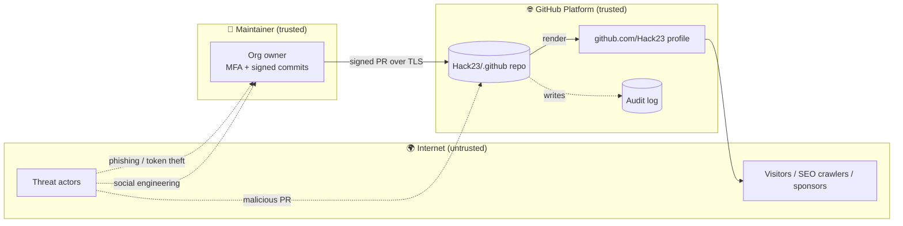
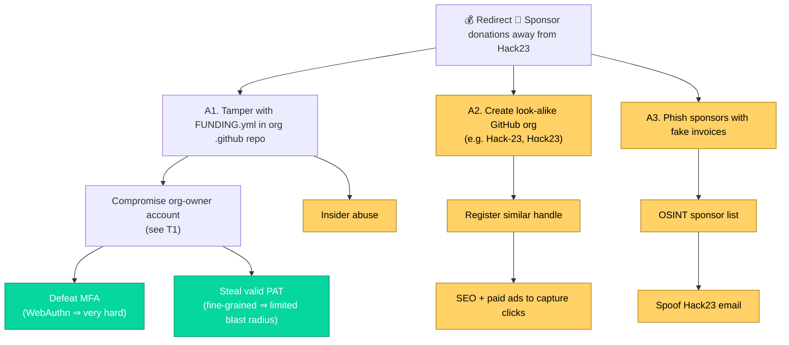

<!-- SPDX-FileCopyrightText: 2024-2026 Hack23 AB -->
<!-- SPDX-License-Identifier: Apache-2.0 -->

# 🎯 Threat Model — `Hack23/.github`

> STRIDE analysis, attack trees, MITRE ATT&CK mapping and risk treatment for the **Hack23 organisation `.github` meta repository**, per the [Hack23 Threat Modeling Policy](https://github.com/Hack23/ISMS-PUBLIC/blob/main/Threat_Modeling.md).

| Property | Value |
|:---------|:------|
| Owner | CEO (James Pether Sörling) |
| Classification | 🟢 Public |
| Methodology | STRIDE · Attack trees · MITRE ATT&CK · Words of Estimative Probability (WEP) |
| Companion docs | [SECURITY_ARCHITECTURE.md](SECURITY_ARCHITECTURE.md) · [ARCHITECTURE.md](ARCHITECTURE.md) |
| Last review | 2026-04-28 |

---

## 1. Scope & assumptions

**In scope:** the GitHub repository `Hack23/.github`, its branches, tags, audit log, the rendered `github.com/Hack23` org profile, the inherited `FUNDING.yml`, and the human/agent identities that can write to it.

**Out of scope:** GitHub itself (trusted platform); downstream Hack23 applications (each has its own threat model — see [CIA THREAT_MODEL.md](https://github.com/Hack23/cia/blob/master/THREAT_MODEL.md), [Black Trigram THREAT_MODEL.md](https://github.com/Hack23/blacktrigram/blob/main/THREAT_MODEL.md), etc.); end-user devices.

**Trust assumptions:**

- GitHub's platform-level controls (TLS, infra, audit log integrity) are trusted.
- All commits to `main` are signed and verified.
- Branch protection, MFA and required reviews remain enabled.

---

## 2. Asset inventory

| Asset | CIA | Why it matters |
|:------|:---:|:--------------|
| `profile/README.md` | 🔴 I · 🟡 A | First impression to visitors and SEO entry point. |
| `FUNDING.yml` | 🔴 I | A tampered sponsor handle would redirect 💖 Sponsor money. |
| `SECURITY_ARCHITECTURE.md` / `THREAT_MODEL.md` / `ARCHITECTURE.md` | 🟠 I | Compliance evidence; tampering could fabricate posture. |
| `README.md` (root) | 🟡 I | Navigation hub. |
| Org-owner GitHub identities | 🔴 C · 🔴 I | Compromise = full org takeover. |
| GitHub Actions secrets (org-level) | 🔴 C | Could be abused via PRs from forks if mis-scoped. |

---

## 3. Data-flow / trust boundaries

**Trust boundaries:** ① Internet → maintainer device; ② Maintainer → GitHub; ③ GitHub repo → GitHub render pipeline.

---

## 4. STRIDE analysis

| # | Threat | STRIDE | Likelihood (WEP) | Impact | Existing mitigation | Residual |
|:--|:-------|:------:|:----------------:|:------:|:--------------------|:--------:|
| T1 | Account takeover of org owner via credential theft | **S** Spoofing | Unlikely (5–20%) | 🔴 Critical (full org control) | Mandatory WebAuthn MFA · device verification · GitHub anomaly alerts | 🟢 Low |
| T2 | Forged commit pretending to be a maintainer | **S** Spoofing | Very unlikely (<5%) | 🟠 High (false attribution) | Required signed commits · GPG/SSH verification · linear history | 🟢 Low |
| T3 | Tampering with `FUNDING.yml` to redirect sponsorship money | **T** Tampering | Unlikely (5–20%) — *only via T1 or insider* | 🔴 Critical (financial fraud, reputational) | Branch protection · required review · audit log · org-owner-only write | 🟢 Low |
| T4 | Tampering with `profile/README.md` to insert phishing or defamatory content | **T** Tampering | Unlikely (5–20%) | 🟠 High (reputation) | Same as T3 + GitHub Watch alerts to maintainers | 🟢 Low |
| T5 | Removal/alteration of ISMS-aligned docs to fabricate compliance | **T** Tampering · **R** Repudiation | Very unlikely (<5%) | 🟠 High (audit fraud) | Immutable Git history · public ISMS-PUBLIC cross-references · annual review | 🟢 Low |
| T6 | Repudiation of malicious change by attacker | **R** Repudiation | Very unlikely (<5%) | 🟡 Medium | Signed commits · GitHub audit log · ISO 27001 review cycle | 🟢 Low |
| T7 | Information disclosure of secrets accidentally committed | **I** Info disclosure | Unlikely (5–20%) — repo holds no secrets by design | 🟡 Medium | Secret scanning · push protection · public-by-default classification (no secrets allowed) | 🟢 Low |
| T8 | DoS / unavailability of org profile | **D** DoS | Unlikely (5–20%) | 🟢 Low (no business impact) | GitHub SLA · global CDN · DDoS protection | 🟢 Low |
| T9 | Elevation of privilege via misconfigured GitHub Actions or PAT | **E** Elevation | Unlikely (5–20%) | 🔴 Critical | Fine-grained PATs · no `pull_request_target` here · least-privilege org-owner role | 🟢 Low |
| T10 | Malicious PR introduces tracking pixels / external scripts in Markdown | **T** Tampering · **I** Info disclosure | Unlikely (5–20%) | 🟡 Medium (visitor privacy) | GitHub Markdown sanitisation strips scripts · review · CSP at hack23.com | 🟢 Low |
| T11 | LLM / agent injection into a PR body or doc that misleads later review | **T** Tampering | Possible (20–45%) — *AI assistants are widely used* | 🟡 Medium | [AI Policy](https://github.com/Hack23/ISMS-PUBLIC/blob/main/AI_Policy.md) · [OWASP LLM Security Policy](https://github.com/Hack23/ISMS-PUBLIC/blob/main/OWASP_LLM_Security_Policy.md) · human review of every PR · prompt-injection awareness | 🟡 Medium |
| T12 | Typosquatting / fake "Hack23" org or look-alike repo to deceive sponsors | **S** Spoofing | Possible (20–45%) | 🟠 High (financial fraud against sponsors) | Canonical links from `hack23.com` · prominent `github.com/sponsors/Hack23` URL on every surface · GitHub verified-org status | 🟡 Medium |

---

## 5. Attack tree — “Steal Hack23 sponsorship money”

**Most likely attack path** (by WEP): A2 (look-alike org) — because it bypasses Hack23's controls entirely and only requires GitHub account creation + SEO. Mitigation: keep canonical sponsor URL prominent everywhere, request GitHub verified-org / verified-domain status, monitor for typosquats.

---

## 6. MITRE ATT&CK mapping

| Tactic | Technique | Relevance | Mitigation |
|:-------|:----------|:----------|:-----------|
| Initial Access | T1566 Phishing | Phishing of org owner | MFA · security training · [Acceptable Use Policy](https://github.com/Hack23/ISMS-PUBLIC/blob/main/Acceptable_Use_Policy.md) |
| Initial Access | T1078 Valid Accounts | Stolen GitHub credentials | WebAuthn MFA · session monitoring |
| Credential Access | T1552.004 Private Keys | Theft of GPG/SSH signing keys | Hardware-backed keys · key rotation per [Cryptography Policy](https://github.com/Hack23/ISMS-PUBLIC/blob/main/Cryptography_Policy.md) |
| Defense Evasion | T1070 Indicator Removal | Force-push to rewrite history | Branch protection forbids force-push · linear history |
| Defense Evasion | T1556 Modify Authentication | Disable branch protection | Org-owner audit log alerts |
| Persistence | T1098.001 Additional Cloud Credentials | Add malicious deploy/SSH key | Audit log · key inventory review |
| Impact | T1491 Defacement | Tamper with profile README | Required review · Watch alerts · backup via Git clones |
| Impact | T1657 Financial Theft | Tamper with FUNDING.yml | Branch protection · required review · canonical sponsor URL elsewhere |
| Resource Development | T1583.001 Acquire Domains/Accounts | Register look-alike org | External monitoring · GitHub verified-org |

---

## 7. Risk treatment & follow-up

| Risk | Treatment | Owner | Status |
|:-----|:----------|:------|:------:|
| T1 (account takeover) | **Mitigate** — WebAuthn enforced, anomaly alerts on | CEO | ✅ |
| T3/T4 (tampering) | **Mitigate** — branch protection, required signed reviews | CEO | ✅ |
| T11 (LLM injection in PRs) | **Mitigate** — human review per [AI Policy](https://github.com/Hack23/ISMS-PUBLIC/blob/main/AI_Policy.md); prompt-injection-aware reviewers | CEO | 🟡 Ongoing |
| T12 (typosquat orgs) | **Monitor** — pursue GitHub verified-org status, periodic search for look-alikes | CEO | 🟡 Open |
| T7 (accidental secret commit) | **Prevent** — push protection on; repo classification 🟢 Public, no secrets allowed | CEO | ✅ |

Risks tracked in the [Risk Register](https://github.com/Hack23/ISMS-PUBLIC/blob/main/Risk_Register.md).

---

## 8. Review cadence

- **Annual** review (next: 2027-04).
- **Event-triggered** review on: any change to repo permissions, addition of GitHub Actions, addition of new org members, or material change to GitHub platform features (e.g. new sponsorship mechanisms).

---

## 9. References

- 🎯 [Threat Modeling Policy](https://github.com/Hack23/ISMS-PUBLIC/blob/main/Threat_Modeling.md)
- 🛡️ [SECURITY_ARCHITECTURE.md](SECURITY_ARCHITECTURE.md) — controls referenced above
- 🏛️ [ARCHITECTURE.md](ARCHITECTURE.md) — system context
- 🔐 [Information Security Policy](https://github.com/Hack23/ISMS-PUBLIC/blob/main/Information_Security_Policy.md)
- 🤖 [AI Policy](https://github.com/Hack23/ISMS-PUBLIC/blob/main/AI_Policy.md) · [OWASP LLM Security Policy](https://github.com/Hack23/ISMS-PUBLIC/blob/main/OWASP_LLM_Security_Policy.md)
- 🚨 [Incident Response Plan](https://github.com/Hack23/ISMS-PUBLIC/blob/main/Incident_Response_Plan.md)
- 📉 [Risk Register](https://github.com/Hack23/ISMS-PUBLIC/blob/main/Risk_Register.md)
- 📊 [Compliance Checklist](https://github.com/Hack23/ISMS-PUBLIC/blob/main/Compliance_Checklist.md)
- 🥋 Sister threat models: [CIA](https://github.com/Hack23/cia/blob/master/THREAT_MODEL.md) · [Black Trigram](https://github.com/Hack23/blacktrigram/blob/main/THREAT_MODEL.md) · [CIA Compliance Manager](https://github.com/Hack23/cia-compliance-manager/blob/main/docs/architecture/THREAT_MODEL.md)
