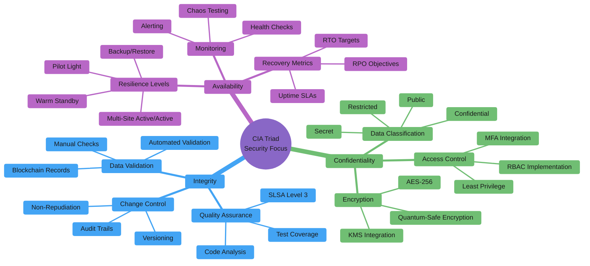
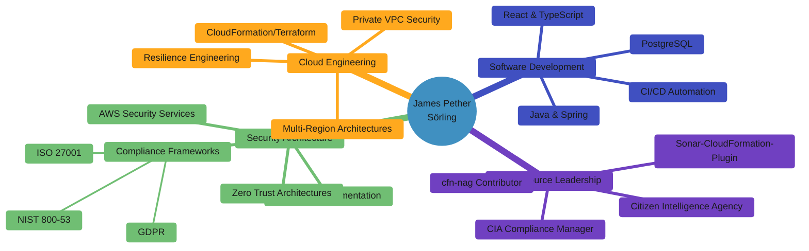

# 🔒 Hack23 AB
### Swedish innovation hub specializing in creating immersive and precise game experiences alongside expert cybersecurity consulting and solutions.

  <a href="https://hack23.com">https://hack23.com</a>
  
  

    
    
    
    
  

## 🔐 Commitment to Transparency and Security

At Hack23 AB, we believe that true security comes through transparency and demonstrable practices. Our Information Security Management System (ISMS) is publicly available, showcasing our commitment to security excellence and organizational transparency.

<table>
  <tr>
    <td width="50%">
      

        <h3>📋 Public ISMS Repository</h3>
        
Complete Information Security Management System documentation

        
      

    </td>
    <td width="50%">
      

        <h3>🔒 Information Security Policy</h3>
        
Enterprise-grade security framework and governance

        
      

    </td>
  </tr>
</table>

### 🏆 Security Through Transparency

Our approach to cybersecurity consulting is built on a foundation of transparent practices:

- **🔍 Open Documentation**: Complete ISMS framework available for review
- **📋 Policy Transparency**: Detailed security policies and procedures publicly accessible  
- **🎯 Demonstrable Expertise**: Our own security implementation serves as a live demonstration
- **🔄 Continuous Improvement**: Public documentation enables community feedback and enhancement

  
<em>"Our commitment to transparency extends to our security practices - demonstrating that true security comes from robust processes, continuous improvement, and a culture where security considerations are integrated into every business decision."</em>

  
<strong>— James Pether Sörling, CEO/Founder</strong>

---

# 🔥 Black Trigram (흑괘)

<table>
  <tr>
    <td width="120" align="center">
      
      

        
      

    </td>
    <td>
      
<strong>Realistic 2D precision combat simulator</strong> inspired by traditional Korean martial arts, focusing on precise anatomical targeting, authentic combat techniques, and detailed physics-based interactions.

      

        
        
      

      

        <a href="https://blacktrigram.com"><strong>🌐 Official Website</strong></a> •
        <a href="https://github.com/Hack23/blacktrigram"><strong>📂 Repository</strong></a> •
        <a href="https://hack23.com/black-trigram-docs.html"><strong>📚 Documentation</strong></a>
      

    </td>
  </tr>
</table>

### 🔐 CIA Compliance Manager

<table>
  <tr>
    <td width="120" align="center">
      
      

        
      

    </td>
    <td>
      
<strong>Security assessment platform for the CIA triad (Confidentiality, Integrity, Availability)</strong> with business impact analysis and compliance mapping to regulatory frameworks like NIST, ISO, GDPR, HIPAA, and SOC2.

      

        
        
        
      

      

        <a href="https://hack23.github.io/cia-compliance-manager/"><strong>🚀 Live Demo</strong></a> •
        <a href="https://github.com/Hack23/cia-compliance-manager"><strong>📂 Repository</strong></a> •
        <a href="https://hack23.com/cia-compliance-manager-features.html"><strong>✨ Features</strong></a> •
        <a href="https://hack23.com/cia-compliance-manager-docs.html"><strong>📚 Documentation</strong></a>
      

    </td>
  </tr>
</table>

### 🔍 Citizen Intelligence Agency

<table>
  <tr>
    <td width="120" align="center">
      
      

        
      

    </td>
    <td>
      
<strong>Political transparency platform</strong> monitoring Swedish political activity with data-driven insights, analytics, dashboard visualizations, and accountability metrics.

      

        
        
        
      

      

        <a href="https://github.com/Hack23/cia"><strong>📂 Repository</strong></a> •
        <a href="https://hack23.com/cia-features.html"><strong>✨ Features</strong></a> •
        <a href="https://hack23.com/cia-docs.html"><strong>📚 Documentation</strong></a>
      

    </td>
  </tr>
</table>

### ☁️ Lambda in Private VPC

<table>
  <tr>
    <td width="120" align="center">
      
      

        
      

    </td>
    <td>
      
<strong>Enterprise-grade multi-region active/active architecture</strong> with near-zero recovery time, comprehensive DNS failover, and AWS Resilience Hub policy compliance for mission-critical applications.

      

        
        
      

      

        <a href="https://github.com/Hack23/lambda-in-private-vpc"><strong>📂 Repository</strong></a> •
        <a href="https://github.com/Hack23/lambda-in-private-vpc#-architecture-design"><strong>🏗️ Architecture</strong></a>
      

    </td>
  </tr>
</table>

### 🧪 Sonar-CloudFormation-Plugin

<table>
  <tr>
    <td width="120" align="center">
      
      

        
      

    </td>
    <td>
      
<strong>SonarQube plugin for analyzing AWS CloudFormation templates</strong> with security best practices based on NIST, CWE, and ISO standards.

      

        
        
      

      

        <a href="https://github.com/Hack23/sonar-cloudformation-plugin"><strong>📂 Repository</strong></a> •
        <a href="http://mvnrepository.com/artifact/com.hack23.sonar/sonar-cloudformation-plugin"><strong>📦 Maven Central</strong></a>
      

    </td>
  </tr>
</table>

## 🔑 Security Services

Professional cybersecurity consulting services delivered remotely or in-person in Gothenburg. Drawing from over three decades of experience in software development and security architecture, we deliver practical security solutions that integrate seamlessly into your development processes without hindering innovation.

---

## 📋 Service Overview

<table>
  <tr>
    <td>🌐 Availability</td>
    <td>Remote or in-person (Gothenburg)</td>
  </tr>
  <tr>
    <td>💰 Pricing</td>
    <td>Contact for pricing</td>
  </tr>
  <tr>
    <td>🏢 Company</td>
    <td>Hack23 AB (Org.nr 5595347807)</td>
  </tr>
  <tr>
    <td>📧 Contact</td>
    <td>LinkedIn</td>
  </tr>
</table>

---

## 🎯 Core Service Areas

<table>
  <tr>
    <th>Area</th>
    <th>Services</th>
    <th>Ideal for</th>
  </tr>
  <tr>
    <td>🏗️ Security Architecture & Strategy</td>
    <td>
      Enterprise Security Architecture: Design and implementation of comprehensive security frameworks 
      Risk Assessment & Management: Systematic identification and mitigation of security risks 
      Security Strategy Development: Alignment of security initiatives with business objectives 
      Governance Framework Design: Policy development and security awareness programs
    </td>
    <td>Organizations needing strategic security leadership and architectural guidance</td>
  </tr>
  <tr>
    <td>☁️ Cloud Security & DevSecOps</td>
    <td>
      Secure Cloud Solutions: AWS security assessment and architecture (Advanced level) 
      DevSecOps Integration: Security seamlessly integrated into agile development processes 
      Infrastructure as Code Security: Secure CloudFormation, Terraform implementations 
      Container & Serverless Security: Modern application security best practices
    </td>
    <td>Development teams transitioning to cloud-native architectures with security focus</td>
  </tr>
  <tr>
    <td>🔧 Secure Development & Code Quality</td>
    <td>
      Secure SDLC Implementation: Building security into development lifecycles 
      CI/CD Security Integration: Automated security testing and validation 
      Code Quality & Security Analysis: Static analysis, vulnerability scanning 
      Supply Chain Security: SLSA Level 3 compliance, SBOM implementation
    </td>
    <td>Development teams seeking to embed security without slowing innovation</td>
  </tr>
</table>

---

## 🏆 Specialized Expertise

<table>
  <tr>
    <th>Category</th>
    <th>Services</th>
    <th>Value</th>
  </tr>
  <tr>
    <td>📋 Compliance & Regulatory</td>
    <td>
      Regulatory Compliance: GDPR, NIS2, ISO 27001 implementation 
      ISMS Design & Implementation: Information Security Management Systems 
      AI Governance: Emerging AI risk management frameworks 
      Audit Preparation: Documentation and evidence preparation
    </td>
    <td>Navigate complex regulatory landscapes with confidence</td>
  </tr>
  <tr>
    <td>🌐 Open Source Security</td>
    <td>
      Open Source Program Office: OSPO establishment and management 
      Vulnerability Management: Open source risk assessment and remediation 
      Security Tool Development: Custom security solutions and automation 
      Community Engagement: Open source security best practices
    </td>
    <td>Leverage open source securely while contributing to security transparency</td>
  </tr>
  <tr>
    <td>🎓 Security Culture & Training</td>
    <td>
      Security Awareness Programs: Building organization-wide security culture 
      Developer Security Training: Secure coding practices and methodologies 
      Leadership Security Briefings: Executive-level security understanding 
      Incident Response Training: Preparedness and response capability building
    </td>
    <td>Transform security from barrier to enabler through education and culture</td>
  </tr>
</table>

---

## 💡 Why Choose Hack23 Security Services?

Three decades of hands-on experience in software development and security architecture means we understand the real challenges development teams face. We don't just point out problems—we provide practical, implementable solutions that enhance security without slowing down innovation.

**Our approach:** Security should be seamlessly integrated into your existing processes, not bolted on afterward. We help organizations build a culture of security awareness where protection becomes a natural part of how teams work, not an obstacle to overcome.

**Passionate about transparency:** As advocates for open source security, we believe in sharing knowledge and building community. Our solutions are designed to be understandable, maintainable, and aligned with industry best practices.

### 🏛️ CIA Compliance Manager Documentation

<table>
  <tr>
    <td width="50%">
      <h4>Current Architecture</h4>
      <ul>
        <li><a href="https://github.com/Hack23/cia-compliance-manager/blob/main/docs/architecture/ARCHITECTURE.md">🏛️ System Architecture</a></li>
        <li><a href="https://github.com/Hack23/cia-compliance-manager/blob/main/docs/architecture/STATEDIAGRAM.md">🔄 Security State Diagrams</a></li>
        <li><a href="https://github.com/Hack23/cia-compliance-manager/blob/main/docs/architecture/FLOWCHART.md">📊 Process Flowcharts</a></li>
        <li><a href="https://github.com/Hack23/cia-compliance-manager/blob/main/docs/architecture/MINDMAP.md">🧠 System Mindmaps</a></li>
        <li><a href="https://github.com/Hack23/cia-compliance-manager/blob/main/docs/architecture/SWOT.md">💼 SWOT Analysis</a></li>
        <li><a href="https://github.com/Hack23/cia-compliance-manager/blob/main/docs/architecture/WORKFLOWS.md">🔧 CI/CD Workflows</a></li>
      </ul>
    </td>
    <td width="50%">
      <h4>Future Vision</h4>
      <ul>
        <li><a href="https://github.com/Hack23/cia-compliance-manager/blob/main/docs/architecture/FUTURE_ARCHITECTURE.md">🔮 Future Architecture</a></li>
        <li><a href="https://github.com/Hack23/cia-compliance-manager/blob/main/docs/architecture/FUTURE_STATEDIAGRAM.md">🔮 Future State Diagrams</a></li>
        <li><a href="https://github.com/Hack23/cia-compliance-manager/blob/main/docs/architecture/FUTURE_FLOWCHART.md">🔮 Future Workflows</a></li>
        <li><a href="https://github.com/Hack23/cia-compliance-manager/blob/main/docs/architecture/FUTURE_MINDMAP.md">🔮 Future Mindmaps</a></li>
        <li><a href="https://github.com/Hack23/cia-compliance-manager/blob/main/docs/architecture/FUTURE_SWOT.md">🔮 Future SWOT Analysis</a></li>
        <li><a href="https://github.com/Hack23/cia-compliance-manager/blob/main/docs/architecture/FUTURE_DATA_MODEL.md">🔮 Future Data Model</a></li>
      </ul>
    </td>
  </tr>
</table>

### 🏛️ Citizen Intelligence Agency Documentation

<table>
  <tr>
    <td width="50%">
      <h4>Current Architecture</h4>
      <ul>
        <li><a href="https://github.com/Hack23/cia/blob/master/ARCHITECTURE.md">🏛️ System Architecture</a></li>
        <li><a href="https://github.com/Hack23/cia/blob/master/SECURITY_ARCHITECTURE.md">🔒 Security Architecture</a></li>
        <li><a href="https://github.com/Hack23/cia/blob/master/DATA_MODEL.md">💾 Data Model</a></li>
        <li><a href="https://github.com/Hack23/cia/blob/master/FLOWCHART.md">📊 Process Flowcharts</a></li>
        <li><a href="https://github.com/Hack23/cia/blob/master/MINDMAP.md">🧠 System Mindmaps</a></li>
        <li><a href="https://github.com/Hack23/cia/blob/master/SWOT.md">💼 SWOT Analysis</a></li>
      </ul>
    </td>
    <td width="50%">
      <h4>Future Vision & Operations</h4>
      <ul>
        <li><a href="https://github.com/Hack23/cia/blob/master/FUTURE_ARCHITECTURE.md">🔮 Future Architecture</a></li>
        <li><a href="https://github.com/Hack23/cia/blob/master/FUTURE_SECURITY_ARCHITECTURE.md">🔮 Future Security Architecture</a></li>
        <li><a href="https://github.com/Hack23/cia/blob/master/FUTURE_DATA_MODEL.md">🔮 Future Data Model</a></li>
        <li><a href="https://github.com/Hack23/cia/blob/master/FinancialSecurityPlan.md">💰 Financial Security Plan</a></li>
        <li><a href="https://github.com/Hack23/cia/blob/master/End-of-Life-Strategy.md">📅 End-of-Life Strategy</a></li>
      </ul>
    </td>
  </tr>
</table>

## 🔑 Security Focus Areas

## 🌟 Featured in Press & Media

<table>
  <tr>
    <td width="33%">
      

        <h3>🗞️ Computer Sweden</h3>
        
Featured article on innovative use of technology for political transparency

        <a href="https://computersweden.idg.se/2.2683/1.229120/tekniken-som-avslojar-politikerna">Read Article</a>
      

    </td>
    <td width="33%">
      

        <h3>📰 Riksdag och Departement</h3>
        
Coverage on Citizen Intelligence Agency's monitoring capabilities

        <a href="https://web.archive.org/web/20090527045800/http:/www.rod.se/Artikelarkiv/2009/CIA-haller-koll-pa-riksdagsledamoterna/">Read Article</a>
      

    </td>
    <td width="33%">
      

        <h3>📊 National Democratic Institute</h3>
        
Recognized in survey of parliamentary monitoring organizations

        <a href="https://www.ndi.org/sites/default/files/governance-parliamentary-monitoring-organizations-survey-september-2011.pdf">View Report</a>
      

    </td>
  </tr>
</table>

## 🎤 Technical Talks & Presentations

<table>
  <tr>
    <td width="50%">
      

        <h3>🎙️ Javaforum Göteborg</h3>
        
Presentation on secure architecture patterns

        
      

    </td>
    <td width="50%">
      

        <h3>🎙️ Shift Left Like A Boss</h3>
        
Security podcast guest appearance discussing DevSecOps

        
      

    </td>
  </tr>
</table>

## 💼 About James Pether Sörling

Experienced technology professional specializing in information security and delivery of secure cloud systems. Strong advocate for transparency in organizations and committed to ensuring robust security posture for modern applications through open source solutions.

## 📫 Connect

  
  
  
  

  
Last updated: 2025-05-13 08:23:39

