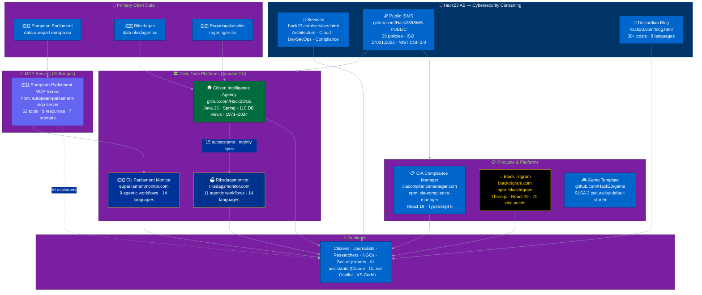
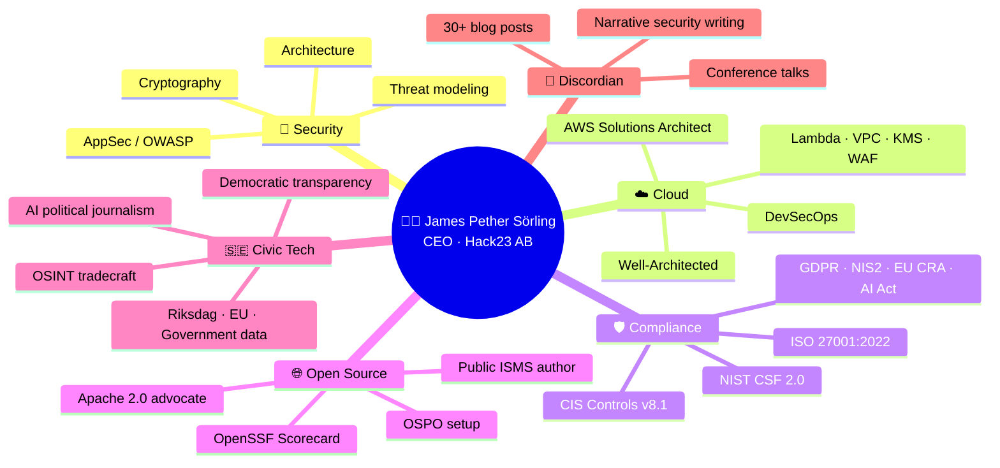

<!-- SPDX-FileCopyrightText: 2008-2026 Hack23 AB (Org.nr 559534-7807, Gothenburg, Sweden) -->
<!-- SPDX-License-Identifier: Apache-2.0 -->
<!--
  Hack23 AB — organisation profile README
  Rendered automatically at https://github.com/Hack23
  SEO meta keywords: Hack23, cybersecurity consulting, Sweden, ISMS, ISO 27001:2022,
  NIST CSF 2.0, CIS Controls v8.1, GDPR, NIS2, EU CRA, AWS security, DevSecOps,
  Citizen Intelligence Agency, Riksdagsmonitor, EU Parliament Monitor,
  European Parliament MCP Server, CIA Compliance Manager, Black Trigram,
  Discordian cybersecurity, civic tech, political intelligence, OSINT,
  AI political news, Apache 2.0, open source security, James Pether Sörling.
-->

  

<h1 align="center">🔒 Hack23 AB</h1>

  <strong>Swedish Cybersecurity Consulting · Public ISMS · Civic-Tech &amp; AI Political-Intelligence Open Source</strong> 
  <em>🛡️ ISO 27001:2022 · 🔐 NIST CSF 2.0 · 🎯 CIS Controls v8.1 · 🇪🇺 GDPR &amp; EU CRA · ☁️ AWS Security · 🤖 AI Newsrooms · 🍎 Discordian Transparency</em>

  <em>"Specialists in security architecture, cloud security, DevSecOps, AI governance and open source — building radical transparency into every layer."</em>

<!-- ───────────────────────── Quick links ───────────────────────── -->

  
  
  
  
  

  
  
  
  

<!-- ───────────────────────── Compliance badges ───────────────────────── -->

  
  
  
  
  
  
  
  

---

## 🎯 Mission

> **Make security and democratic transparency tangible through evidence-based open source.**

Hack23 AB is an independent Swedish cybersecurity consultancy and civic-tech publisher founded by **[James Pether Sörling](https://www.linkedin.com/in/jamessorling/)**. We deliver:

- 🔐 **Cybersecurity consulting** — security architecture, cloud/AWS security, DevSecOps, ISMS implementation, AI governance and compliance (ISO 27001:2022, NIST CSF 2.0, CIS Controls v8.1, GDPR, NIS2, EU CRA).
- 🛡️ **A fully public ISMS** — 38 policies, machine-verifiable, version-controlled at [Hack23/ISMS-PUBLIC](https://github.com/Hack23/ISMS-PUBLIC).
- 🤖 **Six flagship open-source projects** — political-intelligence platforms, AI newsrooms, compliance tooling and a Korean martial-arts simulator — all **Apache-2.0** and aligned with the same ISMS.
- 🍎 **30+ Discordian cybersecurity blog posts** — accessible, narrative-driven security writing that maps back to formal policies.
- 🎙️ **Conference talks, training and security culture work** — turning security from a barrier into an enabler.

Everything we ship is **non-partisan, ad-free, GDPR-clean, privacy-by-design and architecturally engineered so it cannot be weaponised** for partisan or commercial influence.

---

## 💖 Sponsor Hack23

> 🌟 **Help us keep our public ISMS, AI political newsrooms and civic-tech open source.** All flagship projects are Apache-2.0, ad-free and operationally funded by [Hack23 AB](https://hack23.com) plus generous sponsors.

  

<table>
  <tr>
    <th width="33%">☕ Personal</th>
    <th width="33%">🏢 Professional</th>
    <th width="34%">🏛️ Institutional</th>
  </tr>
  <tr>
    <td valign="top">
      <strong>Individuals, students, journalists, civic activists.</strong> 
      Funds:
      <ul>
        <li>📡 AWS hosting (CloudFront, S3, Route 53)</li>
        <li>🌐 Domain renewals (riksdagsmonitor.com, euparliamentmonitor.com, blacktrigram.com, hack23.com)</li>
        <li>🍎 Discordian blog publication</li>
      </ul>
    </td>
    <td valign="top">
      <strong>Security professionals, dev teams, OSPOs, NGOs.</strong> 
      Funds:
      <ul>
        <li>🤖 Claude Opus / GPT API costs for the agentic newsrooms</li>
        <li>🛡️ Third-party security scanning (DAST, SAST, license scanners)</li>
        <li>📝 ISMS continuous-improvement work</li>
      </ul>
    </td>
    <td valign="top">
      <strong>Universities, research institutes, media organisations.</strong> 
      Funds:
      <ul>
        <li>📊 Long-term archive integrity (1971-onwards parliamentary corpora)</li>
        <li>🌍 14-language translation infrastructure</li>
        <li>🎓 Educational outreach and conference presence</li>
      </ul>
    </td>
  </tr>
</table>

> 👉 **Sponsor at <https://github.com/sponsors/Hack23>** — every contribution is acknowledged (unless anonymity is requested) and helps keep parliamentary monitoring, AI-driven journalism and the Hack23 ISMS independent.

---

## 🌍 The Hack23 Ecosystem

```mermaid
%%{init: {"theme":"base","themeVariables":{"primaryColor":"#0066CC","primaryTextColor":"#fff","primaryBorderColor":"#003366","lineColor":"#94A3B8","secondaryColor":"#003399","tertiaryColor":"#7B1FA2","background":"#0F172A"}}}%%
graph TB
    subgraph CONSULT["💼 Hack23 AB — Cybersecurity Consulting"]
        SVC["🔑 Services<br/>hack23.com/services.html<br/>Architecture · Cloud · DevSecOps · Compliance"]
        ISMS["🔓 Public ISMS<br/>github.com/Hack23/ISMS-PUBLIC<br/>38 policies · ISO 27001:2022 · NIST CSF 2.0"]
        BLOG["🍎 Discordian Blog<br/>hack23.com/blog.html<br/>30+ posts · 8 languages"]
    end

    subgraph SOURCES["📡 Primary Open Data"]
        EP["🇪🇺 European Parliament<br/>data.europarl.europa.eu"]
        RD["🇸🇪 Riksdagen<br/>data.riksdagen.se"]
        REG["🇸🇪 Regeringskansliet<br/>regeringen.se"]
    end

    subgraph MCP["🔌 MCP Servers (AI Bridges)"]
        EPMCP["🇪🇺 European-Parliament-MCP-Server<br/>npm: european-parliament-mcp-server<br/>62 tools · 9 resources · 7 prompts"]
    end

    subgraph CIVIC["🏛️ Civic-Tech Platforms (Apache 2.0)"]
        CIA["🕵️ Citizen Intelligence Agency<br/>github.com/Hack23/cia<br/>Java 26 · Spring · 110 DB views · 1971–2024"]
        RM["🗳️ Riksdagsmonitor<br/>riksdagsmonitor.com<br/>11 agentic workflows · 14 languages"]
        EUM["🇪🇺 EU Parliament Monitor<br/>euparliamentmonitor.com<br/>9 agentic workflows · 14 languages"]
    end

    subgraph PRODUCT["📋 Products & Platforms"]
        CCM["📋 CIA Compliance Manager<br/>ciacompliancemanager.com<br/>npm: cia-compliance-manager<br/>React 19 · TypeScript 6"]
        BT["🥋 Black Trigram<br/>blacktrigram.com<br/>npm: blacktrigram<br/>Three.js · React 19 · 70 vital points"]
        GAME["🎮 Game Template<br/>github.com/Hack23/game<br/>SLSA 3 secure-by-default starter"]
    end

    subgraph AUDIENCE["👥 Audience"]
        USERS["Citizens · Journalists · Researchers · NGOs · Security teams · AI assistants (Claude · Cursor · Copilot · VS Code)"]
    end

    EP --> EPMCP
    EPMCP --> EUM
    RD --> CIA
    REG --> CIA
    CIA -->|"15 subsystems · nightly sync"| RM
    EUM --> USERS
    RM --> USERS
    CIA --> USERS
    CCM --> USERS
    BT --> USERS
    EPMCP -.->|"AI assistants"| USERS
    SVC --> USERS
    ISMS --> CIVIC
    ISMS --> PRODUCT
    BLOG --> USERS

    style CONSULT fill:#003366,stroke:#0066CC,color:#fff
    style ISMS fill:#0066CC,stroke:#003366,color:#fff
    style EPMCP fill:#6366F1,stroke:#4F46E5,color:#fff
    style CIA fill:#006B3F,stroke:#003F25,color:#fff
    style RM fill:#00338D,stroke:#FECC00,color:#fff
    style EUM fill:#003399,stroke:#FFCC00,color:#fff
    style CCM fill:#0066CC,stroke:#003366,color:#fff
    style BT fill:#000000,stroke:#FFD700,color:#FFD700
```

> **Single mission, one ISMS, one license (Apache-2.0), one set of compliance frameworks** — applied identically across consulting, civic-tech and commercial products.

---

## 🚀 Flagship Open-Source Projects

Each project has its own ISMS-aligned `SECURITY_ARCHITECTURE.md`, `THREAT_MODEL.md`, OpenSSF Scorecard, OpenSSF Best Practices badge, SLSA 3 attestation and SonarCloud quality gate.

### 🗳️ Riksdagsmonitor — Swedish Political Intelligence

> AI-driven monitoring of Sweden's Riksdag, Government and public agencies — 349 current MPs, 2,494 historical politicians (1971–2024), 3.5M+ votes, 109,000+ documents, **14 languages**, every day.

  
  
  
  
  
  
  

🔗 **Surfaces:** [Live](https://riksdagsmonitor.com) · [Political Intelligence Hub](https://riksdagsmonitor.com/political-intelligence.html) · [AI Newsroom](https://riksdagsmonitor.com/news/index.html) · [Dashboard](https://riksdagsmonitor.com/dashboard/index.html) · [Sitemap](https://riksdagsmonitor.com/sitemap.html) · [Features](https://hack23.com/riksdagsmonitor-features.html) · [Docs](https://hack23.com/riksdagsmonitor-docs.html)

### 🇪🇺 EU Parliament Monitor — European Political Intelligence

> Brussels and Strasbourg made readable. AI-newsroom over the European Parliament's open data — 8 unified gh-aw workflows, 51 analytical artifacts per run, **14 languages**, 1,700+ daily artifacts, full Admiralty / WEP / SAT / ACH tradecraft.

  
  
  
  
  
  
  

🔗 **Surfaces:** [Live](https://euparliamentmonitor.com) · [Political Intelligence Hub](https://euparliamentmonitor.com/political-intelligence.html) · [Sitemap](https://euparliamentmonitor.com/sitemap.html) · [API Docs](https://euparliamentmonitor.com/docs/api/) · [Features](https://hack23.com/euparliamentmonitor-features.html) · [Docs](https://hack23.com/euparliamentmonitor-docs.html)

### 🔌 European Parliament MCP Server — AI Data Backbone

> Canonical TypeScript Model Context Protocol server bridging the **European Parliament Open Data Portal v2** to any MCP-aware AI client (Claude Desktop, VS Code, Cursor, GitHub Copilot). 62 tools, 9 resources, 7 prompts, full GDPR-by-design.

  
  
  
  
  
  

🔗 **Surfaces:** [Repository](https://github.com/Hack23/European-Parliament-MCP-Server) · [npm](https://www.npmjs.com/package/european-parliament-mcp-server) · [API Docs](https://hack23.github.io/European-Parliament-MCP-Server/api/) · [Features](https://hack23.com/european-parliament-mcp-features.html) · [Docs](https://hack23.com/european-parliament-mcp-docs.html)

### 🕵️ Citizen Intelligence Agency (CIA) — Sweden's Data Backbone

> Java/Spring/Vaadin OSINT platform monitoring Sweden's Riksdag, Government and Myndigheter since 2008. **110 database views, 50 risk-detection rules, 1971–2024 longitudinal coverage, 3.5M+ votes, 109K+ documents.** The data backbone behind Riksdagsmonitor.

  
  
  
  
  
  
  
  

🔗 **Surfaces:** [Repository](https://github.com/Hack23/cia) · [Architecture](https://github.com/Hack23/cia/blob/master/ARCHITECTURE.md) · [Security Architecture](https://github.com/Hack23/cia/blob/master/SECURITY_ARCHITECTURE.md) · [Threat Model](https://github.com/Hack23/cia/blob/master/THREAT_MODEL.md) · [Features](https://hack23.com/cia-features.html) · [Docs](https://hack23.com/cia-docs.html)

### 📋 CIA Compliance Manager — Browser-Based GRC

> React 19 / TypeScript 6 platform for **CIA-triad assessment, multi-framework compliance, threat modeling and business-impact quantification**. Available as a live web app and a tree-shakeable npm library with 10 subpath exports.

  
  
  
  
  
  
  

🔗 **Surfaces:** [Live App](https://ciacompliancemanager.com) · [npm](https://www.npmjs.com/package/cia-compliance-manager) · [API Docs](https://ciacompliancemanager.com/docs/api/) · [Features](https://hack23.com/cia-compliance-manager-features.html) · [Docs](https://hack23.com/cia-compliance-manager-docs.html)

### 🥋 Black Trigram (흑괘) — Korean Martial-Arts Combat Simulator

> Production-ready 3D precision combat simulator. **Eight I Ching trigram stances · 70 vital points · 51 authentic Korean martial-arts techniques · 5 fighter archetypes · 60fps desktop / 55fps+ mobile**. React 19 · Three.js · TypeScript 6 · Vite 8.

  
  
  
  
  
  
  

🔗 **Surfaces:** [Play](https://blacktrigram.com) · [API Docs](https://hack23.github.io/blacktrigram/) · [Security Architecture](https://github.com/Hack23/blacktrigram/blob/main/SECURITY_ARCHITECTURE.md) · [Threat Model](https://github.com/Hack23/blacktrigram/blob/main/THREAT_MODEL.md) · [Features](https://hack23.com/black-trigram-features.html) · [Docs](https://hack23.com/black-trigram-docs.html)

### 🎮 Game Template — Secure-by-Default Game Starter

> Reference implementation of a secure web-game project: **React + TypeScript + Three.js + Vite**, SLSA 3, full SBOM, automated security testing, ISMS-policy mapping ready to fork.

  
  

### ☁️ Lambda in Private VPC — AWS Reference Architecture

> Battle-tested reference implementation: **AWS Lambda in a private VPC with VPC endpoints, CloudFront, WAF, KMS encryption, CloudTrail and Security Hub** integration.

  
  

### 🧪 Sonar-CloudFormation-Plugin — Infrastructure-as-Code Static Analysis

> Open-source SonarQube plugin that brings **CloudFormation IaC scanning** into existing SonarQube/SonarCloud quality gates.

  
  

---

## 🛡️ Public ISMS — `Hack23/ISMS-PUBLIC`

> **A fully public, version-controlled, machine-verifiable Information Security Management System.** 38 policies covering access control, cryptography, secure development, threat modeling, vulnerability management, AI governance, GDPR privacy, EU CRA, ISO 27001:2022, NIST CSF 2.0, CIS Controls v8.1.

  
  
  

| Domain | Key Policies |
|:-------|:-------------|
| 🛠️ **Secure Development** | [Secure Development Policy](https://github.com/Hack23/ISMS-PUBLIC/blob/main/Secure_Development_Policy.md) · [Threat Modeling](https://github.com/Hack23/ISMS-PUBLIC/blob/main/Threat_Modeling.md) · [Vulnerability Management](https://github.com/Hack23/ISMS-PUBLIC/blob/main/Vulnerability_Management.md) · [Change Management](https://github.com/Hack23/ISMS-PUBLIC/blob/main/Change_Management.md) |
| 🔑 **Access &amp; Identity** | [Access Control Policy](https://github.com/Hack23/ISMS-PUBLIC/blob/main/Access_Control_Policy.md) · [Segregation of Duties](https://github.com/Hack23/ISMS-PUBLIC/blob/main/Segregation_of_Duties_Policy.md) · [Mobile Device Management](https://github.com/Hack23/ISMS-PUBLIC/blob/main/Mobile_Device_Management_Policy.md) |
| 🌐 **Network &amp; Crypto** | [Network Security Policy](https://github.com/Hack23/ISMS-PUBLIC/blob/main/Network_Security_Policy.md) · [Cryptography Policy](https://github.com/Hack23/ISMS-PUBLIC/blob/main/Cryptography_Policy.md) |
| 💾 **Continuity** | [Backup &amp; Recovery](https://github.com/Hack23/ISMS-PUBLIC/blob/main/Backup_Recovery_Policy.md) · [Business Continuity Plan](https://github.com/Hack23/ISMS-PUBLIC/blob/main/Business_Continuity_Plan.md) · [Disaster Recovery Plan](https://github.com/Hack23/ISMS-PUBLIC/blob/main/Disaster_Recovery_Plan.md) |
| 🚨 **Incident** | [Incident Response Plan](https://github.com/Hack23/ISMS-PUBLIC/blob/main/Incident_Response_Plan.md) |
| 🤖 **AI &amp; LLM** | [AI Policy](https://github.com/Hack23/ISMS-PUBLIC/blob/main/AI_Policy.md) · [OWASP LLM Security Policy](https://github.com/Hack23/ISMS-PUBLIC/blob/main/OWASP_LLM_Security_Policy.md) |
| 📊 **Risk &amp; Compliance** | [Risk Register](https://github.com/Hack23/ISMS-PUBLIC/blob/main/Risk_Register.md) · [Risk Assessment Methodology](https://github.com/Hack23/ISMS-PUBLIC/blob/main/Risk_Assessment_Methodology.md) · [Compliance Checklist](https://github.com/Hack23/ISMS-PUBLIC/blob/main/Compliance_Checklist.md) · [Security Metrics](https://github.com/Hack23/ISMS-PUBLIC/blob/main/Security_Metrics.md) · [ISMS Metrics Dashboard](https://github.com/Hack23/ISMS-PUBLIC/blob/main/ISMS_METRICS_DASHBOARD.md) |
| 🇪🇺 **Regulatory** | [Privacy Policy](https://github.com/Hack23/ISMS-PUBLIC/blob/main/Privacy_Policy.md) (GDPR) · [CRA Conformity Assessment Process](https://github.com/Hack23/ISMS-PUBLIC/blob/main/CRA_Conformity_Assessment_Process.md) (EU CRA) · [ISO 5230 Self-Certification](https://github.com/Hack23/ISMS-PUBLIC/blob/main/ISO_5230_Self_Certification.md) |
| 🌟 **Transparency** | [ISMS Transparency Plan](https://github.com/Hack23/ISMS-PUBLIC/blob/main/ISMS_Transparency_Plan.md) · [Open Source Policy](https://github.com/Hack23/ISMS-PUBLIC/blob/main/Open_Source_Policy.md) · [STYLE_GUIDE](https://github.com/Hack23/ISMS-PUBLIC/blob/main/STYLE_GUIDE.md) |

> 🌟 **Why public?** Because security claims must be auditable. Every customer, regulator, journalist or curious citizen can read, fork, critique or reuse our ISMS — and can independently verify that what we ship matches what we say.

---

## 🔑 Cybersecurity Consulting Services

We deliver hands-on, evidence-based cybersecurity work across five practice areas. Read the full service catalogue at **[hack23.com/services.html](https://hack23.com/services.html)**.

<table>
  <tr>
    <th>🔐 Security Architecture</th>
    <th>☁️ Cloud Security &amp; DevSecOps</th>
    <th>📋 Compliance &amp; Regulatory</th>
  </tr>
  <tr>
    <td valign="top">
      Threat modeling (STRIDE, MITRE ATT&amp;CK), zero-trust architecture, secure SDLC, OWASP Top 10 / SAMM, identity &amp; access, cryptography &amp; key management.  
      <a href="https://hack23.com/services.html#security-architecture"><strong>Read more →</strong></a>
    </td>
    <td valign="top">
      AWS Well-Architected (Security pillar), VPC &amp; WAF design, IAM least-privilege, GuardDuty / Security Hub / KMS / CloudTrail, GitHub Actions hardening, SLSA 3, SBOM.  
      <a href="https://hack23.com/services.html#cloud-security-devsecops"><strong>Read more →</strong></a>
    </td>
    <td valign="top">
      ISO 27001:2022, NIST CSF 2.0, CIS Controls v8.1, GDPR, NIS2, EU CRA, AI Act, SOC 2 readiness, supplier due-diligence, SBOM &amp; ISO 5230 alignment.  
      <a href="https://hack23.com/services.html#compliance-regulatory"><strong>Read more →</strong></a>
    </td>
  </tr>
  <tr>
    <th>🌐 Open Source &amp; OSPO</th>
    <th>🎓 Training &amp; Security Culture</th>
    <th>🤖 AI Governance</th>
  </tr>
  <tr>
    <td valign="top">
      OSPO setup, license &amp; SBOM management, contributor agreements, OpenSSF Scorecard adoption, supply-chain hardening, FOSSA / FOSDEM workflows.  
      <a href="https://hack23.com/services.html#open-source-ospo"><strong>Read more →</strong></a>
    </td>
    <td valign="top">
      Tabletop exercises, secure-coding workshops, threat-modeling clinics, executive briefings, Discordian-style narrative training that actually sticks.  
      <a href="https://hack23.com/services.html#training-security-culture"><strong>Read more →</strong></a>
    </td>
    <td valign="top">
      OWASP LLM Top 10, AI Act readiness, prompt-injection defence, agentic-workflow review (gh-aw), MCP server hardening, AI-in-CI/CD risk assessment.  
      <a href="https://hack23.com/services.html#ai-governance"><strong>Read more →</strong></a>
    </td>
  </tr>
</table>

📨 **Engage us:** <https://hack23.com/contact.html> · LinkedIn: <https://www.linkedin.com/in/jamessorling/>

---

## 🍎 Discordian Cybersecurity Blog — `hack23.com/blog.html`

> **30+ posts** of accessible, narrative-driven security writing — every post maps back to formal ISMS policies and reference implementations.

  
  

Selected pillar posts:

- [🍎 The Discordian Manifesto for Cybersecurity](https://hack23.com/manifesto.html)
- [🛡️ Building a Public ISMS — Why &amp; How](https://hack23.com/blog.html)
- [🔌 What Is the Model Context Protocol (and How We Use It for Open Government Data)](https://hack23.com/blog.html)
- [🤖 Agentic Workflows for Political Journalism — gh-aw, Claude Opus, Zero Editors](https://hack23.com/blog.html)
- [🇪🇺 EU Cyber Resilience Act — A Self-Assessment Walkthrough](https://hack23.com/blog.html)

→ Full archive at **[hack23.com/blog.html](https://hack23.com/blog.html)** (8 languages, JSON-LD structured data, full RSS).

---

## 👨‍💼 About — James Pether Sörling

> **Founder &amp; CEO of Hack23 AB.** 25+ years in software security, cloud architecture, civic-tech and OSINT. Independent, non-partisan, opinionated about transparency.

  
  
  

```mermaid
mindmap
  root((👨‍💼 James Pether Sörling<br/>CEO · Hack23 AB))
    🔐 Security
      Architecture
      Threat modeling
      Cryptography
      AppSec / OWASP
    ☁️ Cloud
      AWS Solutions Architect
      Well-Architected
      DevSecOps
      Lambda · VPC · KMS · WAF
    🛡️ Compliance
      ISO 27001:2022
      NIST CSF 2.0
      CIS Controls v8.1
      GDPR · NIS2 · EU CRA · AI Act
    🌐 Open Source
      Apache 2.0 advocate
      OSPO setup
      Public ISMS author
      OpenSSF Scorecard
    🇸🇪 Civic Tech
      OSINT tradecraft
      Riksdag · EU · Government data
      AI political journalism
      Democratic transparency
    🍎 Discordian
      Narrative security writing
      30+ blog posts
      Conference talks
```

→ Full bio, certifications and engagement options at **[hack23.com/about.html](https://hack23.com/about.html)**.

---

## 🎙️ Talks, Press &amp; Recognition

  
  

- 🎤 Conference talks on AWS security, OSINT, ISMS-as-code, Apache POI, agentic AI workflows, civic tech and parliamentary monitoring
- 📰 Coverage on civic-tech transparency, parliamentary OSINT, Riksdagsmonitor and the Hack23 public ISMS
- 🏅 OpenSSF Best Practices, OpenSSF Scorecard, SLSA Level 3, FOSSA license-clean across all flagship repos

→ Slides &amp; recordings: **[github.com/Hack23/talks](https://github.com/Hack23/talks)** · Press: **[hack23.com/press.html](https://hack23.com/press.html)**

---

## 🗺️ Site Map &amp; SEO Index

Every Hack23 surface is cross-linked for discoverability. Bookmark the [hack23.com sitemap](https://hack23.com/sitemap.html) for the human-readable index in 8 languages, or use the per-project links below.

| Project / Topic | Repository | Live / Hosted | Features | Docs |
|:----------------|:----------:|:-------------:|:--------:|:----:|
| 🔒 **Hack23 AB** | — | [hack23.com](https://hack23.com) | [Services](https://hack23.com/services.html) · [About](https://hack23.com/about.html) · [Press](https://hack23.com/press.html) · [Contact](https://hack23.com/contact.html) | [Blog](https://hack23.com/blog.html) · [Sitemap](https://hack23.com/sitemap.html) |
| 🛡️ **Public ISMS** | [ISMS-PUBLIC](https://github.com/Hack23/ISMS-PUBLIC) | — | [38 policies](https://github.com/Hack23/ISMS-PUBLIC#-policies) | [README](https://github.com/Hack23/ISMS-PUBLIC#readme) |
| 🗳️ **Riksdagsmonitor** | [riksdagsmonitor](https://github.com/Hack23/riksdagsmonitor) | [riksdagsmonitor.com](https://riksdagsmonitor.com) | [Features](https://hack23.com/riksdagsmonitor-features.html) | [Docs](https://hack23.com/riksdagsmonitor-docs.html) · [PI Hub](https://riksdagsmonitor.com/political-intelligence.html) |
| 🇪🇺 **EU Parliament Monitor** | [euparliamentmonitor](https://github.com/Hack23/euparliamentmonitor) | [euparliamentmonitor.com](https://euparliamentmonitor.com) | [Features](https://hack23.com/euparliamentmonitor-features.html) | [Docs](https://hack23.com/euparliamentmonitor-docs.html) · [PI Hub](https://euparliamentmonitor.com/political-intelligence.html) |
| 🔌 **EP MCP Server** | [European-Parliament-MCP-Server](https://github.com/Hack23/European-Parliament-MCP-Server) | [npm](https://www.npmjs.com/package/european-parliament-mcp-server) · [Portal](https://hack23.github.io/European-Parliament-MCP-Server/) | [Features](https://hack23.com/european-parliament-mcp-features.html) | [Docs](https://hack23.com/european-parliament-mcp-docs.html) |
| 🕵️ **Citizen Intelligence Agency** | [cia](https://github.com/Hack23/cia) | [hack23.github.io/cia](https://hack23.github.io/cia/) | [Features](https://hack23.com/cia-features.html) | [Docs](https://hack23.com/cia-docs.html) |
| 📋 **CIA Compliance Manager** | [cia-compliance-manager](https://github.com/Hack23/cia-compliance-manager) | [ciacompliancemanager.com](https://ciacompliancemanager.com) | [Features](https://hack23.com/cia-compliance-manager-features.html) | [Docs](https://hack23.com/cia-compliance-manager-docs.html) · [API](https://ciacompliancemanager.com/docs/api/) |
| 🥋 **Black Trigram** | [blacktrigram](https://github.com/Hack23/blacktrigram) | [blacktrigram.com](https://blacktrigram.com) | [Features](https://hack23.com/black-trigram-features.html) | [Docs](https://hack23.com/black-trigram-docs.html) · [API](https://hack23.github.io/blacktrigram/) |
| 🎮 **Game Template** | [game](https://github.com/Hack23/game) | — | [README](https://github.com/Hack23/game#readme) | [ISMS Mapping](https://github.com/Hack23/game/blob/master/docs/ISMS_POLICY_MAPPING.md) |
| ☁️ **Lambda in Private VPC** | [aws-lambda-private-vpc](https://github.com/Hack23/aws-lambda-private-vpc) | — | [Tutorial](https://hack23.com/blog.html) | [README](https://github.com/Hack23/aws-lambda-private-vpc#readme) |
| 🧪 **Sonar CFN Plugin** | [sonar-cloudformation-plugin](https://github.com/Hack23/sonar-cloudformation-plugin) | [SonarCloud](https://sonarcloud.io/organizations/hack23/projects) | [README](https://github.com/Hack23/sonar-cloudformation-plugin#readme) | — |
| 🎙️ **Talks** | [talks](https://github.com/Hack23/talks) | — | [Slides](https://github.com/Hack23/talks#talks) | — |
| 🍎 **Discordian Blog** | — | [hack23.com/blog.html](https://hack23.com/blog.html) | [Manifesto](https://hack23.com/manifesto.html) | — |

---

## 🤝 Get in Touch

  
  
  
  

- 🔐 **Cybersecurity consulting**: <https://hack23.com/contact.html>
- 🛡️ **ISMS questions**: open an issue on [`Hack23/ISMS-PUBLIC`](https://github.com/Hack23/ISMS-PUBLIC/issues)
- 🐛 **Vulnerability disclosure**: see each repo's `SECURITY.md` (or [`Hack23/.github/SECURITY_ARCHITECTURE.md`](https://github.com/Hack23/.github/blob/main/SECURITY_ARCHITECTURE.md))
- 💖 **Sponsor**: <https://github.com/sponsors/Hack23>

---

  <em>"Security is transparency in action. Democracy is transparency at scale. Hack23 is both — in code." 🍎</em>

  © 2008–2026 <strong>Hack23 AB</strong> (Org.nr 559534-7807, Gothenburg, Sweden) · <a href="https://github.com/Hack23/ISMS-PUBLIC/blob/main/Information_Security_Policy.md">Apache License 2.0</a> · <a href="https://github.com/sponsors/Hack23">💖 Sponsor</a>

