# 🔒 Hack23 - Open Source Security & Compliance Tools

  <a href="https://hack23.com">https://hack23.com
  </a>
  
  

    
    
    
    
  

## 🚀 Featured Projects

```mermaid
%%{
  init: {
    'theme': 'base',
    'themeVariables': {
      'primaryColor': '#a0c8e0',
      'primaryTextColor': '#1a1a1a',
      'primaryBorderColor': '#7B1FA2',
      'lineColor': '#7B1FA2',
      'secondaryColor': '#006064',
      'tertiaryColor': '#fff'
    }
  }
}%%
flowchart TD
    classDef confidentiality fill:#8e44ad,stroke:#6c3483,stroke-width:2px,color:white;
    classDef integrity fill:#27ae60,stroke:#1e8449,stroke-width:2px,color:white;
    classDef availability fill:#2980b9,stroke:#1f618d,stroke-width:2px,color:white;
    classDef tools fill:#e67e22,stroke:#d35400,stroke-width:2px,color:white;
    
    HACK23["🔒 Hack23<br>Open Source Security"]
    
    HACK23 --> CIA["🔐 CIA Compliance Manager<br>(Security Assessment)"]
    HACK23 --> CIT["🔍 Citizen Intelligence Agency<br>(Political Transparency)"]
    HACK23 --> LAMBDA["☁️ Lambda in Private VPC<br>(AWS Architecture)"]
    HACK23 --> SONAR["🧪 Sonar-CloudFormation-Plugin<br>(IaC Security Analysis)"]
    
    CIA --> CIA_1["🔒 Confidentiality<br>Data Protection"]
    CIA --> CIA_2["🔄 Integrity<br>Data Validation"]
    CIA --> CIA_3["⚡ Availability<br>Service Uptime"]
    
    CIT --> CIT_1["🏛️ Political<br>Monitoring"]
    CIT --> CIT_2["📊 Performance<br>Analytics"]
    CIT --> CIT_3["🗳️ Decision<br>Transparency"]
    
    LAMBDA --> LAMBDA_1["🌐 Multi-Region<br>Active/Active"]
    LAMBDA --> LAMBDA_2["🛡️ Mission-Critical<br>Resilience"] 
    LAMBDA --> LAMBDA_3["🔐 Private VPC<br>Security"]
    
    SONAR --> SONAR_1["🔍 CloudFormation<br>Static Analysis"]
    SONAR --> SONAR_2["🛡️ Security<br>Rule Engine"]
    SONAR --> SONAR_3["📊 Quality<br>Visualization"]
    
    class CIA confidentiality;
    class CIA_1,CIA_2,CIA_3 confidentiality;
    
    class CIT integrity;
    class CIT_1,CIT_2,CIT_3 integrity;
    
    class LAMBDA availability;
    class LAMBDA_1,LAMBDA_2,LAMBDA_3 availability;
    
    class SONAR tools;
    class SONAR_1,SONAR_2,SONAR_3 tools;
```

### 🔐 CIA Compliance Manager

<table>
  <tr>
    <td width="120" align="center">
      
      

        
      

    </td>
    <td>
      
<strong>Security assessment platform for the CIA triad (Confidentiality, Integrity, Availability)</strong> with business impact analysis and compliance mapping to regulatory frameworks like NIST, ISO, GDPR, HIPAA, and SOC2.

      

        
        
        
      

      

        <a href="https://hack23.github.io/cia-compliance-manager/"><strong>🚀 Live Demo</strong></a> •
        <a href="https://github.com/Hack23/cia-compliance-manager"><strong>📂 Repository</strong></a> •
        <a href="https://hack23.com/cia-compliance-manager-features.html"><strong>✨ Features</strong></a> •
        <a href="https://hack23.com/cia-compliance-manager-docs.html"><strong>📚 Documentation</strong></a>
      

    </td>
  </tr>
</table>

### 🔍 Citizen Intelligence Agency

<table>
  <tr>
    <td width="120" align="center">
      
      

        
      

    </td>
    <td>
      
<strong>Political transparency platform</strong> monitoring Swedish political activity with data-driven insights, analytics, dashboard visualizations, and accountability metrics.

      

        
        
        
      

      

        <a href="https://github.com/Hack23/cia"><strong>📂 Repository</strong></a> •
        <a href="https://hack23.com/cia-features.html"><strong>✨ Features</strong></a> •
        <a href="https://hack23.com/cia-docs.html"><strong>📚 Documentation</strong></a>
      

    </td>
  </tr>
</table>

### ☁️ Lambda in Private VPC

<table>
  <tr>
    <td width="120" align="center">
      
      

        
      

    </td>
    <td>
      
<strong>Enterprise-grade multi-region active/active architecture</strong> with near-zero recovery time, comprehensive DNS failover, and AWS Resilience Hub policy compliance for mission-critical applications.

      

        
        
      

      

        <a href="https://github.com/Hack23/lambda-in-private-vpc"><strong>📂 Repository</strong></a> •
        <a href="https://github.com/Hack23/lambda-in-private-vpc#-architecture-design"><strong>🏗️ Architecture</strong></a>
      

    </td>
  </tr>
</table>

### 🧪 Sonar-CloudFormation-Plugin

<table>
  <tr>
    <td width="120" align="center">
      
      

        
      

    </td>
    <td>
      
<strong>SonarQube plugin for analyzing AWS CloudFormation templates</strong> with security best practices based on NIST, CWE, and ISO standards.

      

        
        
      

      

        <a href="https://github.com/Hack23/sonar-cloudformation-plugin"><strong>📂 Repository</strong></a> •
        <a href="http://mvnrepository.com/artifact/com.hack23.sonar/sonar-cloudformation-plugin"><strong>📦 Maven Central</strong></a>
      

    </td>
  </tr>
</table>

## 📚 Comprehensive Architecture Documentation

```mermaid
%%{
  init: {
    'theme': 'base',
    'themeVariables': {
      'primaryColor': '#bbdefb',
      'primaryTextColor': '#1a1a1a',
      'primaryBorderColor': '#86b5d9',
      'lineColor': '#86b5d9',
      'secondaryColor': '#c8e6c9',
      'tertiaryColor': '#d1c4e9'
    }
  }
}%%
graph TD
    subgraph "Documentation Framework"
        DOC["📚 Architecture<br>Documentation"]
        
        DOC --> ARCH["🏛️ C4 Models"]
        DOC --> SEC["🔒 Security<br>Architecture"]
        DOC --> PROC["🔄 Process<br>Workflows"]
        DOC --> DATA["💾 Data<br>Models"]
        DOC --> MIND["🧠 Mind<br>Maps"]
        DOC --> SWOT["💼 SWOT<br>Analysis"]
        DOC --> CICD["🔧 CI/CD<br>Pipelines"]
        
        subgraph "CIA Compliance Manager"
            CM_A["Current<br>Architecture"]
            CM_FA["Future<br>Architecture"]
            CM_SD["State<br>Diagrams"]
            CM_PF["Process<br>Flowcharts"]
            CM_MM["Mind<br>Maps"]
            CM_SW["SWOT<br>Analysis"]
            CM_DM["Data<br>Models"]
            CM_CD["CI/CD<br>Workflows"]
        end
        
        subgraph "Citizen Intelligence Agency"
            CIA_A["Current<br>Architecture"]
            CIA_FA["Future<br>Architecture"]
            CIA_SA["Security<br>Architecture"]
            CIA_FSA["Future Security<br>Architecture"]
            CIA_PF["Process<br>Flowcharts"]
            CIA_MM["Mind<br>Maps"]
            CIA_SW["SWOT<br>Analysis"]
            CIA_DM["Data<br>Models"]
            CIA_CD["CI/CD<br>Workflows"]
        end
        
        ARCH --> CM_A & CIA_A
        ARCH --> CM_FA & CIA_FA
        
        SEC --> CIA_SA
        SEC --> CIA_FSA
        
        PROC --> CM_PF & CIA_PF
        
        DATA --> CM_DM & CIA_DM
        
        MIND --> CM_MM & CIA_MM
        
        SWOT --> CM_SW & CIA_SW
        
        CICD --> CM_CD & CIA_CD
    end
    
    classDef docFramework fill:#a0c8e0,stroke:#86b5d9,stroke-width:2px,color:#333;
    classDef docTypes fill:#bbdefb,stroke:#86b5d9,stroke-width:2px,color:#333;
    classDef cmDocs fill:#c8e6c9,stroke:#7dcea0,stroke-width:2px,color:#333;
    classDef ciaDocs fill:#d1c4e9,stroke:#9575cd,stroke-width:2px,color:#333;
    
    class DOC docFramework;
    class ARCH,SEC,PROC,DATA,MIND,SWOT,CICD docTypes;
    class CM_A,CM_FA,CM_SD,CM_PF,CM_MM,CM_SW,CM_DM,CM_CD cmDocs;
    class CIA_A,CIA_FA,CIA_SA,CIA_FSA,CIA_PF,CIA_MM,CIA_SW,CIA_DM,CIA_CD ciaDocs;
```

### 🏛️ CIA Compliance Manager Documentation

<table>
  <tr>
    <td width="50%">
      <h4>Current Architecture</h4>
      <ul>
        <li><a href="https://github.com/Hack23/cia-compliance-manager/blob/main/docs/architecture/ARCHITECTURE.md">🏛️ System Architecture</a></li>
        <li><a href="https://github.com/Hack23/cia-compliance-manager/blob/main/docs/architecture/STATEDIAGRAM.md">🔄 Security State Diagrams</a></li>
        <li><a href="https://github.com/Hack23/cia-compliance-manager/blob/main/docs/architecture/FLOWCHART.md">📊 Process Flowcharts</a></li>
        <li><a href="https://github.com/Hack23/cia-compliance-manager/blob/main/docs/architecture/MINDMAP.md">🧠 System Mindmaps</a></li>
        <li><a href="https://github.com/Hack23/cia-compliance-manager/blob/main/docs/architecture/SWOT.md">💼 SWOT Analysis</a></li>
        <li><a href="https://github.com/Hack23/cia-compliance-manager/blob/main/docs/architecture/WORKFLOWS.md">🔧 CI/CD Workflows</a></li>
      </ul>
    </td>
    <td width="50%">
      <h4>Future Vision</h4>
      <ul>
        <li><a href="https://github.com/Hack23/cia-compliance-manager/blob/main/docs/architecture/FUTURE_ARCHITECTURE.md">🔮 Future Architecture</a></li>
        <li><a href="https://github.com/Hack23/cia-compliance-manager/blob/main/docs/architecture/FUTURE_STATEDIAGRAM.md">🔮 Future State Diagrams</a></li>
        <li><a href="https://github.com/Hack23/cia-compliance-manager/blob/main/docs/architecture/FUTURE_FLOWCHART.md">🔮 Future Workflows</a></li>
        <li><a href="https://github.com/Hack23/cia-compliance-manager/blob/main/docs/architecture/FUTURE_MINDMAP.md">🔮 Future Mindmaps</a></li>
        <li><a href="https://github.com/Hack23/cia-compliance-manager/blob/main/docs/architecture/FUTURE_SWOT.md">🔮 Future SWOT Analysis</a></li>
        <li><a href="https://github.com/Hack23/cia-compliance-manager/blob/main/docs/architecture/FUTURE_DATA_MODEL.md">🔮 Future Data Model</a></li>
      </ul>
    </td>
  </tr>
</table>

### 🏛️ Citizen Intelligence Agency Documentation

<table>
  <tr>
    <td width="50%">
      <h4>Current Architecture</h4>
      <ul>
        <li><a href="https://github.com/Hack23/cia/blob/master/ARCHITECTURE.md">🏛️ System Architecture</a></li>
        <li><a href="https://github.com/Hack23/cia/blob/master/SECURITY_ARCHITECTURE.md">🔒 Security Architecture</a></li>
        <li><a href="https://github.com/Hack23/cia/blob/master/DATA_MODEL.md">💾 Data Model</a></li>
        <li><a href="https://github.com/Hack23/cia/blob/master/FLOWCHART.md">📊 Process Flowcharts</a></li>
        <li><a href="https://github.com/Hack23/cia/blob/master/MINDMAP.md">🧠 System Mindmaps</a></li>
        <li><a href="https://github.com/Hack23/cia/blob/master/SWOT.md">💼 SWOT Analysis</a></li>
      </ul>
    </td>
    <td width="50%">
      <h4>Future Vision & Operations</h4>
      <ul>
        <li><a href="https://github.com/Hack23/cia/blob/master/FUTURE_ARCHITECTURE.md">🔮 Future Architecture</a></li>
        <li><a href="https://github.com/Hack23/cia/blob/master/FUTURE_SECURITY_ARCHITECTURE.md">🔮 Future Security Architecture</a></li>
        <li><a href="https://github.com/Hack23/cia/blob/master/FUTURE_DATA_MODEL.md">🔮 Future Data Model</a></li>
        <li><a href="https://github.com/Hack23/cia/blob/master/FinancialSecurityPlan.md">💰 Financial Security Plan</a></li>
        <li><a href="https://github.com/Hack23/cia/blob/master/End-of-Life-Strategy.md">📅 End-of-Life Strategy</a></li>
      </ul>
    </td>
  </tr>
</table>

## 🔑 Security Focus Areas

## 🌟 Featured in Press & Media

<table>
  <tr>
    <td width="33%">
      

        <h3>🗞️ Computer Sweden</h3>
        
Featured article on innovative use of technology for political transparency

        <a href="https://computersweden.idg.se/2.2683/1.229120/tekniken-som-avslojar-politikerna">Read Article</a>
      

    </td>
    <td width="33%">
      

        <h3>📰 Riksdag och Departement</h3>
        
Coverage on Citizen Intelligence Agency's monitoring capabilities

        <a href="https://web.archive.org/web/20090527045800/http:/www.rod.se/Artikelarkiv/2009/CIA-haller-koll-pa-riksdagsledamoterna/">Read Article</a>
      

    </td>
    <td width="33%">
      

        <h3>📊 National Democratic Institute</h3>
        
Recognized in survey of parliamentary monitoring organizations

        <a href="https://www.ndi.org/sites/default/files/governance-parliamentary-monitoring-organizations-survey-september-2011.pdf">View Report</a>
      

    </td>
  </tr>
</table>

## 🎤 Technical Talks & Presentations

<table>
  <tr>
    <td width="50%">
      

        <h3>🎙️ Javaforum Göteborg</h3>
        
Presentation on secure architecture patterns

        
      

    </td>
    <td width="50%">
      

        <h3>🎙️ Shift Left Like A Boss</h3>
        
Security podcast guest appearance discussing DevSecOps

        
      

    </td>
  </tr>
</table>

## 💼 About James Pether Sörling

Experienced technology professional specializing in information security and delivery of secure cloud systems. Strong advocate for transparency in organizations and committed to ensuring robust security posture for modern applications through open source solutions.

## 📫 Connect

  
  
  
  

  
Last updated: 2025-05-13 08:23:39

